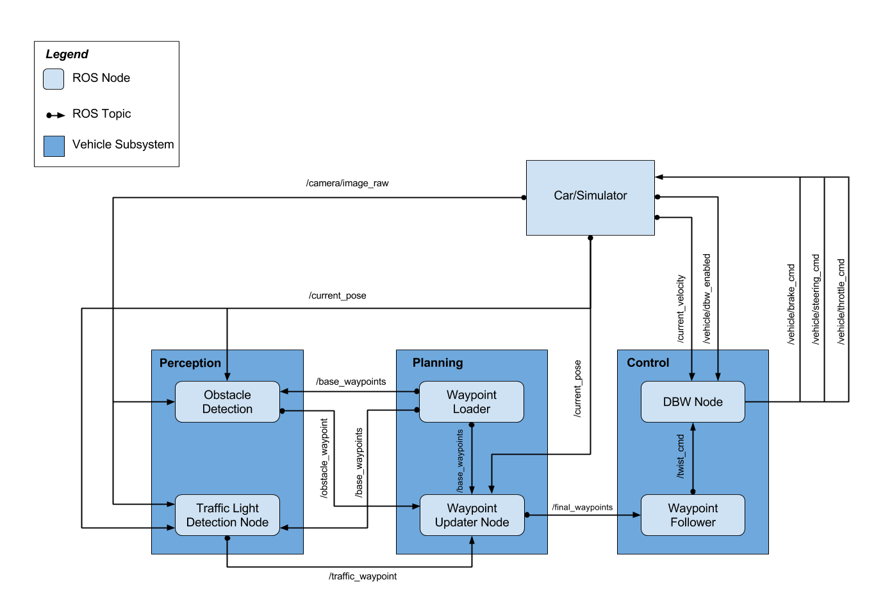

A Team - System Integration Project 
===================================

Udacity Term 3 Final Capstone Project

## Requirements

###  Smoothly follow waypoints in the simulator.
Our code properly guides the car through all of the waypoints. As
discussed by many people in `#p-system-integration` there were points
on the course where it was difficult to maintain control because of
mysterious simulator performance issues. Our different team members
had varying levels of success with this ranging from almost no
problems to very severe impassable points on the course _using the
same code_. Because so much effort was spent to overcome these high
interference zones, we ended up with an extremely stable and accurate
control system that guided the car nearly perfectly (special mention
of Vince's contribution is deserved here).

###  Stop at traffic lights when needed.
Our system takes the published video feed and crops out what we
believe is a sensible sub region. We followed the suggestion implied
in the project materials to locate that region dynamically using dead
reckoning but we found this was not especially helpful. With a
plausible traffic light published when near a known traffic light
location, the next task was to send this image to a classifier that
could determine if it was red, yellow, or green. We tried both a
Tensorflow system and a Keras system, eventually settling on the Keras
as easier to work with for this particular project. The classifier was
trained on a large set of images which, for the simulator, was
extracted from manual driving. For the bag file video, the frames
were extracted and a classifier trained on a large set of data derived
from them (13000 unique images of each of red, yellow, green).

###  Stop and restart PID controllers depending on the state of `/vehicle/dbw_enabled`.
We believe the `dbw_enabled` feature works as required. The simulator
can be put into and returned from "Manual" mode as expected.

### Confirm that traffic light detection works on real life images.
We have set the system up so that when launched with the site launcher
the software behaves with that in mind and can successfully detect
the state of the traffic light.

## Project Components

### Nodes


#### Perception
* Traffic light detection
* Obstacle detection

#### Planning
* Waypoint updater - Sets target velocity for each waypoint based on traffic light and obstacles.

#### Control
* Drive by wire ROS node -
  - input: target trajectory
  - output: control commands to vehicle
* Here's a handy flowchart for PID tuning.

### Car Info
* [ROS Interface to Lincoln MKZ DBW System](https://bitbucket.org/DataspeedInc/dbw_mkz_ros/src/)
* Carla is a https://en.wikipedia.org/wiki/Lincoln_MKZ
* Curb weight = 3,713-3,911 lb (1,684-1,774 kg)

## Run
```
catkin_make && source devel/setup.sh && roslaunch launch/styx.launch
rosbag play -l just_traffic_light.bag
rqt_image_view /image_color
rqt_console
```

## Training the Classifier
***classifier_trainer.py***: contains class ***TLClassifier_Trainer***. This part is the core of the training stage. It reads in sample files and - using a **LeNet** architecture - does the trainig stage and finally stores the model in respective files (*model.** in *light_classification* directory). For now, labeling the images is done by hand, just putting the images in respective directories. The directory structure is as follows:
	- top dir is *pics*
	- the images are stored in directories named *GREEN*, *YELLOW*, *RED* and *UNKNOWN*, respectively:

	(...) light_classification
								
					--> pics
								--> GREEN
								--> YELLOW
								--> RED 
								--> UNKNOWN

The classifier reads in the images from each directory; by knowing the directory the labels are derived.

**Flags:**

* *self.debug = False*: Change to true if you need debug messages. Beware of switching to true when running ROS, the *"debug"* output is just print messages to standard output

## Consuming the Classifier
***tl_classifier.py***: (Provided by **Udacity**): contains *TLClassifier()* class. This  is the *"Client"* class; it loads the model stored in the training step and classifies incoming images. It reuses the logits from the trainer (Not strictly required, but avoids code duplication)

**Flags:**

* *self.debug = True*: set this to false to avoid ROS loginfo messages
* *self.capture_images* = False: Set to True to store incoming images


## Helper/Invoking the Classifier
***train.py***: short helper class. Use this if you need to invoke training. It just instantiates the training class and invokes training.  
